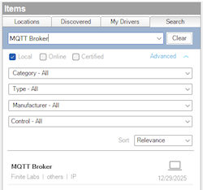

------------------------------------------------------------------------

# Overview

> DISCLAIMER: This software is neither affiliated with nor endorsed by
> either Control4 or TP-Link.

The TP-Link Kasa Power Strip driver provides local, cloud-free control
of Kasa smart power strips (HS300/KP303/KP400) and smart plugs directly
from Control4.

Unlike older Kasa drivers that rely on TP-Link's legacy plaintext
protocol on port 9999, this driver speaks **KLAP** — the encrypted local
protocol TP-Link rolled out in firmware updates starting late 2024,
which **disables the legacy protocol entirely**. If your Kasa device
stopped responding to an existing Control4 driver after a firmware
update, this driver is the fix: it implements the KLAP v2 handshake and
session encryption while retaining the legacy IOT command schema those
devices still use internally.

Each output is exposed as a standard Control4 **relay binding**, along
with per-output events, variables, and real-time power (wattage)
readings for programming.

# Index

- [System Requirements](#system-requirements)
- [Features](#features)
- [Installer Setup](#installer-setup)
  - [Driver Installation](#driver-installation)
  - [Driver Setup](#driver-setup)
    - [Driver Properties](#driver-properties)
      - [Cloud Settings](#cloud-settings)
      - [Driver Settings](#driver-settings)
      - [Kasa Settings](#kasa-settings)
      - [Device Information](#device-information)
      - [Outputs](#outputs)
  - [Driver Actions](#driver-actions)
  - [Connections](#connections)
  - [Programming](#programming)
- [Migrating from a Legacy Kasa
  Driver](#migrating-from-a-legacy-kasa-driver)
- [Troubleshooting](#troubleshooting)
- [Support](#support)
- [Changelog](#changelog)

# System Requirements

- Control4 OS 3.3+
- A TP-Link Kasa power strip or smart plug on KLAP firmware, on the same
  network as the controller (or routable from it)
- The TP-Link (Kasa/Tapo) account credentials the device is bound to

**Verified hardware:**

| Device | Type        | Outputs | Energy Metering  |
|--------|-------------|---------|------------------|
| HS300  | Power strip | 6       | Yes (per outlet) |

Other Kasa devices that use KLAP transport with the legacy IOT command
schema (e.g. KP303, KP400, HS103, HS110, KP115 on post-2024 firmware)
are expected to work; single-outlet devices appear as output 1.

# Features

- **Local control** of each outlet — no TP-Link cloud dependency after
  setup
- **KLAP v2** encrypted transport (works on firmware that disabled port
  9999)
- Standard Control4 **relay bindings** for every output (bind
  relay-controlled devices, use in scenes, dashboards, etc.)
- **Events**: `Output N Turned On` / `Output N Turned Off`, `Connected`,
  `Disconnected`
- **Variables**: `OUTPUT_N_NAME`, `OUTPUT_N_STATE`, `OUTPUT_N_WATT`,
  `VOLTAGE` — same names as the popular legacy Kasa outlet drivers so
  existing programming migrates 1:1
- **Real-time energy monitoring** per outlet with configurable poll rate
- **Programming commands**: Turn Output On / Turn Output Off / Toggle
  Output
- Automatic session recovery (re-handshake) when the device restarts or
  drops the session

# Installer Setup

## Driver Installation

Driver installation and setup are similar to most other ip-based
drivers. Below is an outline of the basic steps for your convenience.

1.  Download the latest `control4-kasa.zip` from
    [Github](https://github.com/finitelabs/control4-kasa/releases/latest).

2.  Extract and
    [install]((https://www.control4.com/help/c4/software/cpro/dealer-composer-help/content/composerpro_userguide/adding_drivers_manually.htm))
    the `kasa_power_strip.c4z` driver.

3.  Use the "Search" tab to find the "TP-Link Kasa Power Strip" driver
    and add it to your project (one instance per physical device).

    

4.  Configure the [Kasa Settings](#kasa-settings) with the device IP
    address and TP-Link account credentials.

5.  After a few moments the [`Driver Status`](#driver-status-read-only)
    will display `Connected`. If the driver fails to connect, set the
    [`Log Mode`](#log-mode--off--print--log--print-and-log-) property to
    `Print` and run action [`Reconnect`](#reconnect) from the actions
    tab. Then check the lua output window for more information.

## Driver Setup

### Driver Properties

#### Cloud Settings

##### Automatic Updates

Turns on/off the GitHub cloud automatic updates.

##### Update Channel

Sets the update channel for which releases are considered during an
automatic update from the GitHub repo releases.

#### Driver Settings

##### Driver Status (read-only)

Displays the current status of the driver:

- `Connected` — session established and the device is responding to
  polls
- `Connecting...` — handshake in progress
- `Disconnected: <reason>` — the device is unreachable or rejected the
  session
- `Set the ... property` — required configuration is missing

##### Driver Version (read-only)

Displays the current version of the driver.

##### Log Level \[ Fatal \| Error \| Warning \| ***Info*** \| Debug \| Trace \| Ultra \]

Sets the logging level. Default is `Info`.

##### Log Mode \[ ***Off*** \| Print \| Log \| Print and Log \]

Sets the logging mode. Default is `Off`.

#### Kasa Settings

##### IP Address

Sets the IP address of the Kasa device (e.g. `192.168.1.50`).

> ⚠️ You should ensure the address will not change by assigning a static
> IP or creating a DHCP reservation for the device.

##### TP-Link Username

Sets the email address of the TP-Link (Kasa/Tapo) account the device is
bound to. **Case sensitive** — enter it exactly as registered.

##### TP-Link Password

Sets the password of the TP-Link account the device is bound to.

> KLAP authentication is derived from the account credentials the device
> was provisioned with in the Kasa/Tapo app. They are used only for the
> local handshake — the driver never contacts TP-Link's cloud.

##### Poll Rate (Seconds) \[ 2 - 300 \]

How often output states are polled. Default is `10`.

##### Energy Poll Rate (Seconds) \[ 0 - 300 \]

How often per-output power usage is polled. `0` disables energy polling.
Default is `5`.

> Energy polling issues one request per outlet per cycle. On a 6-outlet
> strip at the default rate that is a light, steady load the device
> handles easily, but you can raise the interval if you don't use
> wattage in programming.

#### Device Information

##### Model / Device Name / MAC Address / Firmware / WiFi RSSI (read-only)

Reported by the device after connecting. A very low RSSI (below about
-75) often explains slow or flaky responses.

##### Voltage (read-only)

Line voltage reported by the energy meter, when supported.

#### Outputs

##### Output 1 ... Output 6 (read-only)

Displays each output's name (as configured in the Kasa app), current
state, and last power reading, e.g. `Espresso Machine — On — 1243.0 W`.
Outputs that don't exist on the connected device remain blank.

## Driver Actions

##### Refresh Now

Immediately poll the device for output states and energy readings.

##### Reconnect

Discard the current KLAP session and perform a fresh handshake.

##### Update Drivers

Trigger all Kasa drivers to update from the latest release on GitHub,
regardless of the current version.

## Connections

Each output is exposed as a Control4 **relay** control binding
(`Output 1 Relay` ... `Output 6 Relay`). Bind any relay-consuming device
or use the outputs directly from programming. Relay commands
`ON`/`CLOSE`, `OFF`/`OPEN`, `TOGGLE`, and `TRIGGER` (pulse) are
supported.

## Programming

**Events:**

- **Output N Turned On / Turned Off** — Fires when an output changes
  state, whether from Control4, the Kasa app, or the physical button
- **Connected / Disconnected** — Fires when the driver's connection to
  the device is established or lost

**Conditionals:**

- **Device Connected** — Check whether the device is currently connected

**Commands:**

- **Turn Output On / Turn Output Off / Toggle Output** — Control an
  output by number from programming

**Variables (per output N):**

| Variable         | Type   | Description                                 |
|------------------|--------|---------------------------------------------|
| `OUTPUT_N_NAME`  | STRING | Output alias as configured in the Kasa app  |
| `OUTPUT_N_STATE` | BOOL   | Current relay state                         |
| `OUTPUT_N_WATT`  | NUMBER | Current power draw in watts (energy models) |
| `VOLTAGE`        | NUMBER | Line voltage (energy models)                |

> The variable names intentionally match the legacy Kasa outlet drivers,
> so watt-threshold or state-based programming can be re-pointed to this
> driver without restructuring.

# Migrating from a Legacy Kasa Driver

TP-Link firmware released since late 2024 removes the legacy local
protocol (TCP/UDP port 9999) that older Kasa drivers depend on. Affected
devices still respond to ping but refuse driver connections; older
drivers typically show stale output states indefinitely.

To migrate:

1.  Add this driver and configure the [Kasa Settings](#kasa-settings).
    Confirm `Driver Status` shows `Connected` and the outputs populate.
2.  Re-point programming from the old driver to this one. Events,
    commands, and variables use the same names and output numbering as
    the legacy drivers.
3.  Move any relay bindings from the old driver's outputs to this
    driver's.
4.  Remove the old driver.

> ⚠️ Deleting the old driver deletes any programming still attached to
> it. Re-point programming **before** removing the old driver.

# Troubleshooting

**`Disconnected: ... handshake1 auth mismatch ...`** — The device is
bound to a different TP-Link account (or the password is wrong). Enter
the credentials for the account that owns the device in the Kasa/Tapo
app, exactly as registered (the email is case sensitive).

**`Driver Status` stuck at `Connecting...` or timeouts** — Verify the IP
address, that the device is on a network reachable from the controller,
and that nothing is blocking TCP port 80 to the device.

**Device rejects commands with `module not support`** — The device
firmware uses the newer SMART command schema rather than the legacy IOT
schema this driver speaks. File a support request with the device model
and firmware version.

**Output states lag behind the Kasa app** — State changes made outside
Control4 are picked up on the next poll; lower
[`Poll Rate (Seconds)`](#poll-rate-seconds--2---300-) if you need faster
convergence.

# Support

If you have any questions or issues integrating this driver with
Control4, you can file an issue on GitHub:

<https://github.com/finitelabs/control4-kasa/issues/new>

# Changelog

## Unreleased

### Added

- Initial release: local control of TP-Link Kasa power strips and smart
  plugs on KLAP firmware (KLAP v2 transport, legacy IOT command schema).
- Relay bindings, events, variables, and programming commands per
  output.
- Per-outlet real-time energy monitoring with configurable poll rates.
