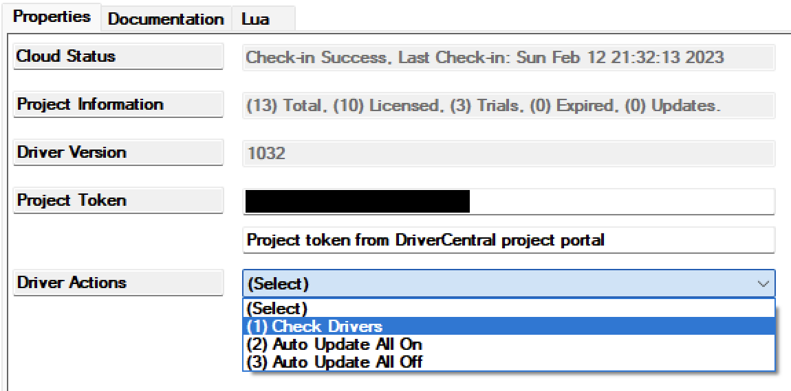

[copyright]: # "Copyright 2026 Finite Labs, LLC. All rights reserved."

---

# Overview

<!-- #ifndef DRIVERCENTRAL -->

> DISCLAIMER: This software is neither affiliated with nor endorsed by either
> Control4 or TP-Link.

<!-- #endif -->

The TP-Link Outlet driver provides local, cloud-free control of Kasa smart power
strips (HS300/KP303/KP400) and smart plugs directly from Control4, on **both**
generations of TP-Link's local protocol.

Older Kasa drivers rely on TP-Link's plaintext protocol on port 9999. TP-Link
firmware updates rolled out since late 2024 disable that protocol and replace it
with KLAP, an encrypted local protocol. This driver implements the KLAP v2
handshake and session encryption while retaining the legacy IOT command schema
those devices still use internally, so devices that stopped responding to older
drivers after a firmware update work again. Devices still on the original
firmware are also supported: the driver auto-detects the protocol and falls back
to the port 9999 transport, so the same driver instance continues to work when
TP-Link migrates the device to KLAP.

Each output is exposed as a standard Control4 **relay binding**, along with
per-output events, variables, and real-time power (wattage) readings for
programming.

# Index

- [System Requirements](#system-requirements)
- [Features](#features)
- [Installer Setup](#installer-setup)
  <!-- #ifdef DRIVERCENTRAL -->
  - [DriverCentral Cloud Setup](#drivercentral-cloud-setup)
  <!-- #endif -->
  - [Driver Installation](#driver-installation)
  - [Driver Setup](#driver-setup)
    - [Driver Properties](#driver-properties)
      - [Cloud Settings](#cloud-settings)
      - [Driver Settings](#driver-settings)
      - [Kasa Settings](#kasa-settings)
      - [Device Information](#device-information)
      - [Outputs](#outputs)
  - [Driver Actions](#driver-actions)
  - [Connections](#connections)
  - [Programming](#programming)
- [Migrating from a Legacy Kasa Driver](#migrating-from-a-legacy-kasa-driver)
- [Troubleshooting](#troubleshooting)
  <!-- #ifdef DRIVERCENTRAL -->
- [Developer Information](#developer-information)

<!-- #endif -->

- [Support](#support)
- [Changelog](#changelog)

# System Requirements

- Control4 OS 3.3+
- A TP-Link Kasa power strip or smart plug on KLAP firmware, on the same network
  as the controller (or routable from it)
- The TP-Link (Kasa/Tapo) account credentials the device is bound to

**Verified hardware:**

| Device | Type        | Outputs | Energy Metering  |
| ------ | ----------- | ------- | ---------------- |
| HS300  | Power strip | 6       | Yes (per outlet) |

Other Kasa devices that use KLAP transport with the legacy IOT command schema
(e.g. KP303, KP400, HS103, HS110, KP115 on post-2024 firmware) are expected to
work; single-outlet devices appear as output 1.

# Features

- **Local control** of each outlet with no TP-Link cloud dependency after setup
- **KLAP v2** encrypted transport (works on firmware that disabled port 9999)
- **Legacy protocol support** with automatic detection. Devices on original Kasa
  firmware work with no credentials required and keep working after TP-Link
  migrates them to KLAP (add your account credentials)
- Standard Control4 **relay bindings** for every output (bind relay-controlled
  devices, use in scenes, dashboards, etc.)
- **Events**: `Output N Turned On` / `Output N Turned Off`, `Connected`,
  `Disconnected`
- **Variables**: `OUTPUT_N_NAME`, `OUTPUT_N_STATE`, `OUTPUT_N_WATT`, and
  `VOLTAGE`, using the same names as the legacy Kasa outlet drivers so existing
  programming migrates 1:1
- **Real-time energy monitoring** per outlet with configurable poll rate
- **Programming commands**: Turn Output On / Turn Output Off / Toggle Output
- Automatic session recovery (re-handshake) when the device restarts or drops
  the session

# Installer Setup

<!-- #ifdef DRIVERCENTRAL -->

## DriverCentral Cloud Setup

> If you already have the
> [DriverCentral Cloud driver](https://drivercentral.io/platforms/control4-drivers/utility/drivercentral-cloud-driver/)
> installed in your project you can continue to
> [Driver Installation](#driver-installation).

This driver relies on the DriverCentral Cloud driver to manage licensing and
automatic updates. If you are new to using DriverCentral you can refer to their
[Cloud Driver](https://help.drivercentral.io/407519-Cloud-Driver) documentation
for setting it up.

<!-- #endif -->

## Driver Installation

Driver installation and setup are similar to most other ip-based drivers. Below
is an outline of the basic steps for your convenience.

<!-- #ifdef DRIVERCENTRAL -->

1. Download the latest `control4-tplink.zip` from
   [DriverCentral](https://drivercentral.io/platforms/control4-drivers/).
2. Extract and
   [install](<(https://www.control4.com/help/c4/software/cpro/dealer-composer-help/content/composerpro_userguide/adding_drivers_manually.htm)>)
   the `tplink_outlet.c4z` driver.
3. Use the "Search" tab to find the "TP-Link Outlet" driver and add it to your
   project (one instance per physical device).

   

4. Select the newly added driver in the "System Design" tab. You will notice
   that the `Cloud Status` reflects the license state. If you have purchased a
   license it will show `License Activated`, otherwise `Trial Running` and
   remaining trial duration.
5. You can refresh license status by selecting the "DriverCentral Cloud" driver
   in the "System Design" tab and perform the "Check Drivers" action.
    
6. Configure the [Kasa Settings](#kasa-settings) with the device IP address and
   TP-Link account credentials.
7. After a few moments the [`Driver Status`](#driver-status-read-only) will
   display `Connected`. If the driver fails to connect, set the
   [`Log Mode`](#log-mode--off--print--log--print-and-log-) property to `Print`
   and run action [`Reconnect`](#reconnect) from the actions tab. Then check the
   lua output window for more information.

<!-- #else -->

1. Download the latest `control4-tplink.zip` from
   [Github](https://github.com/finitelabs/control4-tplink/releases/latest).
2. Extract and
   [install](<(https://www.control4.com/help/c4/software/cpro/dealer-composer-help/content/composerpro_userguide/adding_drivers_manually.htm)>)
   the `tplink_outlet.c4z` driver.
3. Use the "Search" tab to find the "TP-Link Outlet" driver and add it to your
   project (one instance per physical device).

   

4. Configure the [Kasa Settings](#kasa-settings) with the device IP address and
   TP-Link account credentials.
5. After a few moments the [`Driver Status`](#driver-status-read-only) will
   display `Connected`. If the driver fails to connect, set the
   [`Log Mode`](#log-mode--off--print--log--print-and-log-) property to `Print`
   and run action [`Reconnect`](#reconnect) from the actions tab. Then check the
   lua output window for more information.

<!-- #endif -->

## Driver Setup

### Driver Properties

#### Cloud Settings

<!-- #ifdef DRIVERCENTRAL -->

##### Cloud Status

Displays the DriverCentral cloud license status.

<!-- #endif -->

##### Automatic Updates

<!-- #ifdef DRIVERCENTRAL -->

Turns on/off the DriverCentral cloud automatic updates.

<!-- #else -->

Turns on/off the GitHub cloud automatic updates.

##### Update Channel

Sets the update channel for which releases are considered during an automatic
update from the GitHub repo releases.

<!-- #endif -->

#### Driver Settings

##### Driver Status (read-only)

Displays the current status of the driver:

- `Connected`: session established and the device is responding to polls
- `Connecting...`: handshake in progress
- `Disconnected: <reason>`: the device is unreachable or rejected the session
- `Set the ... property`: required configuration is missing

##### Driver Version (read-only)

Displays the current version of the driver.

##### Log Level [ Fatal | Error | Warning | **_Info_** | Debug | Trace | Ultra ]

Sets the logging level. Default is `Info`.

##### Log Mode [ **_Off_** | Print | Log | Print and Log ]

Sets the logging mode. Default is `Off`.

#### Kasa Settings

##### IP Address

Sets the IP address of the Kasa device (e.g. `192.168.1.50`).

> ⚠️ You should ensure the address will not change by assigning a static IP or
> creating a DHCP reservation for the device.

##### Protocol [ **_Auto_** | KLAP | Legacy ]

Selects the local protocol. `Auto` (default) tries KLAP first when credentials
are set and falls back to the legacy port 9999 protocol; without credentials it
connects over the legacy protocol directly. Pin it to `KLAP` or `Legacy` only if
you need to skip detection.

The active protocol is shown in `Driver Status`, e.g. `Connected (KLAP)` or
`Connected (Legacy)`.

##### TP-Link Username

Sets the email address of the TP-Link (Kasa/Tapo) account the device is bound
to. **Case sensitive**, enter it exactly as registered. Required for KLAP
firmware; may be left blank for legacy-firmware devices.

##### TP-Link Password

Sets the password of the TP-Link account the device is bound to. Required for
KLAP firmware; may be left blank for legacy-firmware devices.

> KLAP authentication is derived from the account credentials the device was
> provisioned with in the Kasa/Tapo app. They are used only for the local
> handshake; the driver never contacts TP-Link's cloud. Setting them on a
> legacy-firmware device is harmless and recommended: when TP-Link pushes the
> KLAP firmware update, the driver switches over automatically.

##### Poll Rate (Seconds) [ 2 - 300 ]

How often output states are polled. Default is `10`.

##### Energy Poll Rate (Seconds) [ 0 - 300 ]

How often per-output power usage is polled. `0` disables energy polling. Default
is `5`.

> Energy polling issues one request per outlet per cycle. On a 6-outlet strip at
> the default rate that is a light, steady load the device handles easily, but
> you can raise the interval if you don't use wattage in programming.

#### Device Information

##### Model / Device Name / MAC Address / Firmware / WiFi RSSI (read-only)

Reported by the device after connecting. A very low RSSI (below about -75) often
explains slow or flaky responses.

##### Voltage (read-only)

Line voltage reported by the energy meter, when supported.

#### Outputs

##### Output 1 ... Output 6 (read-only)

Displays each output's name (as configured in the Kasa app), current state, and
last power reading, e.g. `Espresso Machine - On - 1243.0 W`. Outputs that don't
exist on the connected device remain blank.

## Driver Actions

##### Refresh Now

Immediately poll the device for output states and energy readings.

##### Reconnect

Discard the current KLAP session and perform a fresh handshake.

<!-- #ifndef DRIVERCENTRAL -->

##### Update Drivers

Trigger all Kasa drivers to update from the latest release on GitHub, regardless
of the current version.

<!-- #endif -->

## Connections

Each output is exposed as a Control4 **relay** control binding (`Output 1 Relay`
... `Output 6 Relay`). Bind any relay-consuming device or use the outputs
directly from programming. Relay commands `ON`/`CLOSE`, `OFF`/`OPEN`, `TOGGLE`,
and `TRIGGER` (pulse) are supported.

## Programming

**Events:**

- **Output N Turned On / Turned Off**: Fires when an output changes state,
  whether from Control4, the Kasa app, or the physical button
- **Connected / Disconnected**: Fires when the driver's connection to the device
  is established or lost

**Conditionals:**

- **Device Connected**: Check whether the device is currently connected

**Commands:**

- **Turn Output On / Turn Output Off / Toggle Output**: Control an output by
  number from programming

**Variables (per output N):**

| Variable         | Type   | Description                                 |
| ---------------- | ------ | ------------------------------------------- |
| `OUTPUT_N_NAME`  | STRING | Output alias as configured in the Kasa app  |
| `OUTPUT_N_STATE` | BOOL   | Current relay state                         |
| `OUTPUT_N_WATT`  | NUMBER | Current power draw in watts (energy models) |
| `VOLTAGE`        | NUMBER | Line voltage (energy models)                |

> The variable names intentionally match the legacy Kasa outlet drivers, so
> watt-threshold or state-based programming can be re-pointed to this driver
> without restructuring.

# Migrating from a Legacy Kasa Driver

TP-Link firmware released since late 2024 removes the legacy local protocol
(TCP/UDP port 9999) that older Kasa drivers depend on. Affected devices still
respond to ping but refuse driver connections; older drivers typically show
stale output states indefinitely.

To migrate:

1. Add this driver and configure the [Kasa Settings](#kasa-settings). Confirm
   `Driver Status` shows `Connected` and the outputs populate.
2. Re-point programming from the old driver to this one. Events, commands, and
   variables use the same names and output numbering as the legacy drivers.
3. Move any relay bindings from the old driver's outputs to this driver's.
4. Remove the old driver.

> ⚠️ Deleting the old driver deletes any programming still attached to it.
> Re-point programming **before** removing the old driver.

# Troubleshooting

**`Disconnected: ... handshake1 auth mismatch ...`**: The device is bound to a
different TP-Link account (or the password is wrong). Enter the credentials for
the account that owns the device in the Kasa/Tapo app, exactly as registered
(the email is case sensitive).

**`Driver Status` stuck at `Connecting...` or timeouts**: Verify the IP address,
that the device is on a network reachable from the controller, and that nothing
is blocking TCP port 80 to the device.

**Device rejects commands with `module not support`**: The device firmware uses
the newer SMART command schema rather than the legacy IOT schema this driver
speaks. File a support request with the device model and firmware version.

**Output states lag behind the Kasa app**: State changes made outside Control4
are picked up on the next poll; lower
[`Poll Rate (Seconds)`](#poll-rate-seconds--2---300-) if you need faster
convergence.

<!-- #ifdef DRIVERCENTRAL -->

# Developer Information

Copyright © 2026 Finite Labs LLC

All information contained herein is, and remains the property of Finite Labs LLC
and its suppliers, if any. The intellectual and technical concepts contained
herein are proprietary to Finite Labs LLC and its suppliers and may be covered
by U.S. and Foreign Patents, patents in process, and are protected by trade
secret or copyright law. Dissemination of this information or reproduction of
this material is strictly forbidden unless prior written permission is obtained
from Finite Labs LLC.

<!-- #endif -->

# Support

<!-- #ifdef DRIVERCENTRAL -->

If you have any questions or issues integrating this driver with Control4 or
your Kasa device, you can contact us at
[driver-support@finitelabs.com](mailto:driver-support@finitelabs.com) or
call/text us at [+1 (949) 371-5805](tel:+19493715805).

<!-- #else -->

If you have any questions or issues integrating this driver with Control4, you
can file an issue on GitHub:

https://github.com/finitelabs/control4-tplink/issues/new

<!-- #endif -->

<!-- #embed-changelog -->
